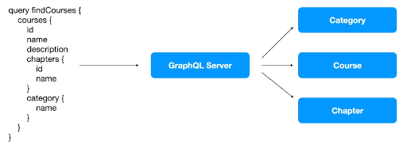
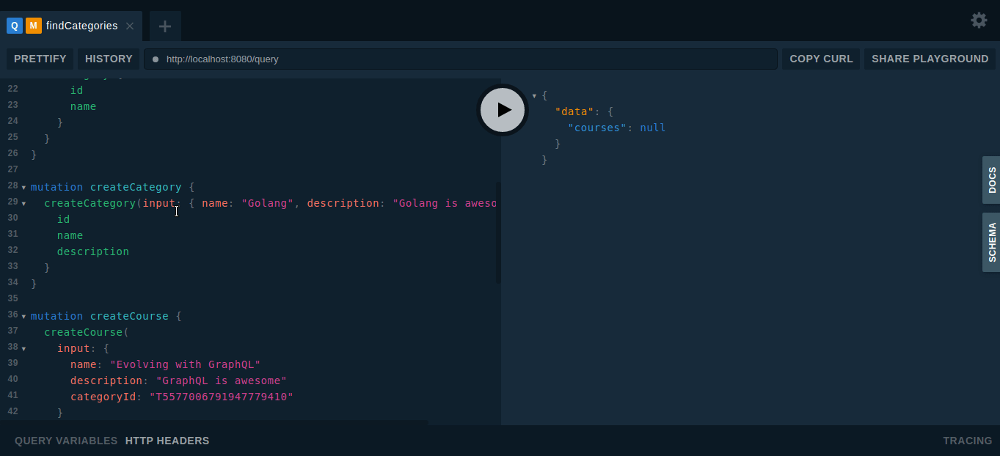

# full-cycle-2.0-graphql

Files I produced during the GraphQL classes of my [Microservices Full Cycle 3.0 course](https://drive.google.com/file/d/1bJnFxQPKgSsI30sCvW-KzYK4V5JWzgSs/view?usp=share_link).

## GraphQL, let the clients choose what they want!



## An example in Golang, gqlgen

https://gqlgen.com/getting-started/

```sh
go mod init github.com/axell-brendow/full-cycle-2.0-graphql
go get github.com/99designs/gqlgen
go run github.com/99designs/gqlgen init  # Generate files for graphql implementations in Go
```

Make sure your go binaries are in your PATH variable. In my case they are at `$HOME/go/bin`.

Restart your terminal then run:

```sh
qglgen generate  # Generate files from your schemas and models
```

To start the GraphQL Playground at localhost:8080, run:

```sh
go run server.go
```

## GraphQL Queries and Mutations



```graphql
query findCategories {
  categories {
    id
    name
    description
    courses {
      name
    }
  }
}

query findCourses {
  courses {
    id
    name
    description
    chapters {
      id
      name
    }
    category {
      id
      name
    }
  }
}

mutation createCategory {
  createCategory(input: { name: "Golang", description: "Golang is awesome" }) {
    id
    name
    description
  }
}

mutation createCourse {
  createCourse(
    input: {
      name: "Evolving with GraphQL"
      description: "GraphQL is awesome"
      categoryId: "T5577006791947779410"
    }
  ) {
    id
    name
    description
    category {
      id
      name
		}
  }
}

mutation createChapter {
	createChapter(
    input: {
      name: "Chapter 1"
      courseId: "T6129484611666145821"
		}
  ) {
    id
    name
    course {
      name
    }
  }
}
```

To optimize N+1 database queries, use [Dataloaders](https://gqlgen.com/reference/dataloaders/)
